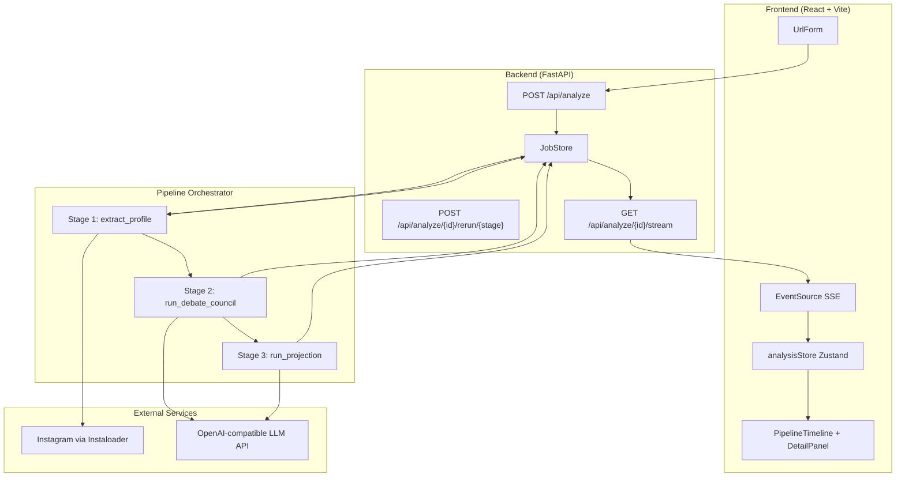
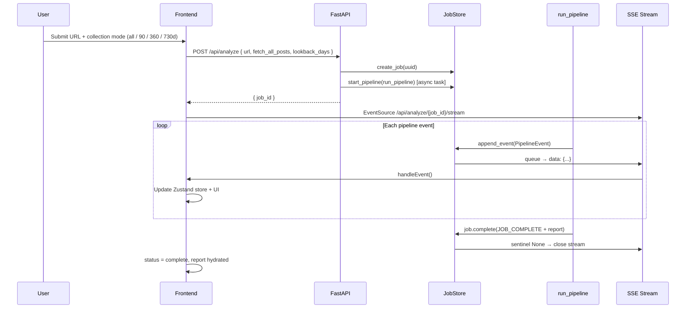
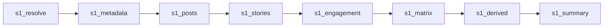
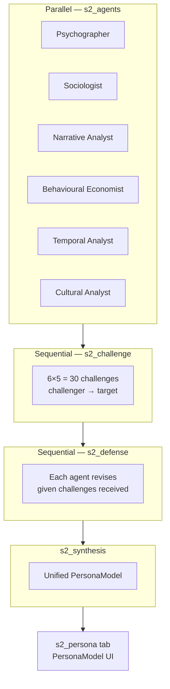
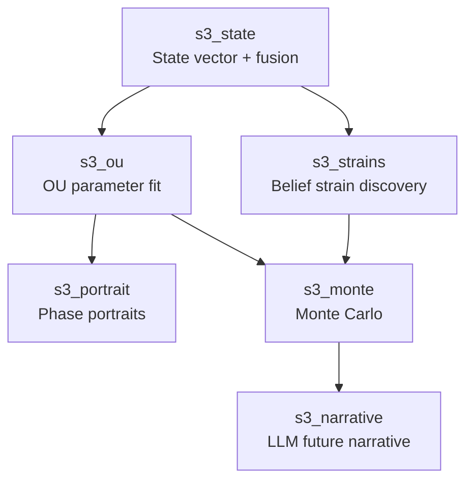
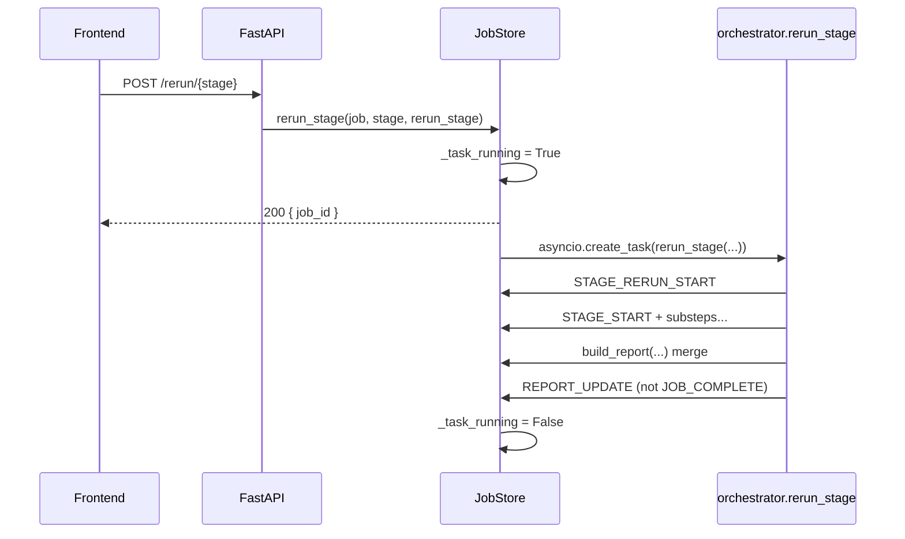

# North Star — Architectural Flow of Events

**Persona Dynamics Engine** · End-to-end system architecture from user input through mathematical projection to live UI.

This document describes the **implemented** system as of the current codebase (`backend/app`, `frontend/src`). It aligns with the conceptual framework in `persona_dynamics_engine_methadology.md` but notes where the code uses pragmatic simplifications.

---

## Table of Contents

1. [System Overview](#1-system-overview)
2. [End-to-End Request Lifecycle](#2-end-to-end-request-lifecycle)
3. [Event Streaming Architecture](#3-event-streaming-architecture)
4. [Stage 1 — Profile Signal Extraction](#4-stage-1--profile-signal-extraction)
5. [Stage 2 — Multi-Agent Debate Council](#5-stage-2--multi-agent-debate-council)
6. [Stage 3 — Future State Projection](#6-stage-3--future-state-projection)
7. [Report Assembly & Completion](#7-report-assembly--completion)
8. [Frontend State Machine](#8-frontend-state-machine)
9. [Module Reference Map](#9-module-reference-map)
10. [Configuration & Operational Notes](#10-configuration--operational-notes)
11. [Stage Rerun Architecture](#11-stage-rerun-architecture)

---

## 1. System Overview

North Star ingests a **public Instagram profile URL**, extracts a temporal signal matrix, runs a **six-agent LLM debate** to synthesize a persona model, then applies **dynamical systems mathematics** (Ornstein–Uhlenbeck process, SIR belief strains, Monte Carlo simulation) to project future psychological state distributions.

### High-level topology



### Three-stage data contract

| Stage | Input | Process | Primary output |
|-------|--------|---------|----------------|
| **1** | Profile URL + collection mode (`fetch_all_posts` or lookback window) | Scrape, enrich, derive metrics | `ProfileSignalMatrix`, `DerivedSignals` |
| **2** | Matrix + derived signals | 6 agents → 30 challenges → defenses → synthesis | `PersonaModel`, `DebateRecord` |
| **3** | Matrix + derived + persona | State history → OU fit → strains → Monte Carlo → narrative | `FutureStateDistribution`, `FutureStateNarrative` |

Final artifact: **`PersonaDynamicsReport`** — serialized JSON delivered via `JOB_COMPLETE` SSE event and `GET /api/analyze/{job_id}`.

---

## 2. End-to-End Request Lifecycle

### Step-by-step sequence



### API surface (`backend/app/main.py`)

| Endpoint | Method | Purpose |
|----------|--------|---------|
| `/api/health` | GET | Liveness + mock mode flag |
| `/api/analyze` | POST | Create job, spawn full pipeline (`AnalyzeRequest`: url, `fetch_all_posts`, lookback_days) |
| `/api/analyze/{job_id}/rerun/{stage}` | POST | Re-execute stage 1, 2, or 3; merge into existing report |
| `/api/analyze/{job_id}/stream` | GET | Server-Sent Events stream of `PipelineEvent` JSON |
| `/api/analyze/{job_id}` | GET | Poll job status + full report when complete |

**AnalyzeRequest defaults:** `fetch_all_posts=true`, `lookback_days=365` (used only when `fetch_all_posts=false`; valid range 90–730).

### Job lifecycle states

```
PENDING → RUNNING → COMPLETE | ERROR
```

- Pipeline runs in `asyncio.create_task` — non-blocking relative to HTTP response.
- Uncaught exceptions in `run_pipeline` emit `ERROR` with stage, substep, traceback, and `recoverable` flag (e.g. LLM timeouts).

---

## 3. Event Streaming Architecture

### Event types (`backend/app/streaming/events.py`)

| Event | When emitted | Frontend effect |
|-------|--------------|-----------------|
| `STAGE_START` | Stage N begins | Stage card → running |
| `STAGE_RERUN_START` | Stage rerun initiated | Reset substeps + domain state from stage N onward |
| `SUBSTEP_START` | Substep begins | Substep → running; track current substep |
| `SUBSTEP_PROGRESS` | Long-running work (posts, MC sims, challenges) | Progress bar + message |
| `SUBSTEP_COMPLETE` | Substep finished with payload | Hydrate domain state (matrix, persona, OU, etc.) |
| `STAGE_COMPLETE` | Stage summary payload | Stage → complete |
| `REPORT_UPDATE` | Stage rerun finished with merged report | Hydrate report; status=complete; **SSE stays open** |
| `ERROR` | Failure | Error console + optional tab switch |
| `JOB_COMPLETE` | Full pipeline finished | status=complete, report tab unlocked; **SSE closes** |

### Pub/sub model (`backend/app/jobs/store.py`)

Each `JobState` maintains:

- `events: list[PipelineEvent]` — full replay log
- `_subscribers: list[asyncio.Queue]` — SSE clients

On `append_event`:

1. Event appended to history
2. Event pushed to all subscriber queues

On `subscribe` (new SSE client):

- Replays all historical events, then streams live

On `complete` / `fail` (full pipeline):

- Pushes `None` sentinel → SSE generator exits

On `finish_rerun` (partial stage rerun):

- Appends `REPORT_UPDATE` only — subscribers **remain open**

**Concurrency:** `JobState._task_running` prevents overlapping pipeline/rerun tasks (HTTP 409 if busy).

### Canonical substep IDs (frontend mirror)

**Stage 1:** `s1_resolve`, `s1_metadata`, `s1_posts`, `s1_stories`, `s1_engagement`, `s1_matrix`, `s1_derived`, `s1_summary`

**Stage 2:** `s2_agents`, `s2_challenge`, `s2_defense`, `s2_synthesis`, `s2_persona` (+ dynamic `s2_agent_*`, `s2_ch_*`, `s2_defense_*`)

**Stage 3:** `s3_state`, `s3_ou`, `s3_portrait`, `s3_strains`, `s3_monte`, `s3_narrative` (+ dynamic `s3_strain_*`)

Note: `s2_persona` is a **frontend canonical substep** marked complete when `s2_synthesis` finishes; it renders `SynthesisPanel` in a separate tab. Round 3 synthesis UI shows claim cards only (persona model moved to this tab).

---

## 4. Stage 1 — Profile Signal Extraction

**Orchestrator call:** `extract_profile(job, emit)` in `backend/app/pipeline/stage1_extract.py`

**Purpose:** Transform a public Instagram profile into a **chronological signal matrix** — the empirical foundation for all downstream inference.

### 4.1 Substep flow



| Substep | Action |
|---------|--------|
| `s1_resolve` | Parse username from URL (`parse_instagram_username`) |
| `s1_metadata` | Fetch profile via Instaloader (`instagram_client.py`) |
| `s1_posts` | Paginate posts — **full archive** (`fetch_all_posts=true`) or **lookback window** (`fetch_all_posts=false`, cutoff = now − lookback_days) |
| `s1_stories` | Active stories + highlight reels |
| `s1_engagement` | Per-post comments, liker samples (`profile_enrichment.py`) |
| `s1_matrix` | Emit full `ProfileSignalMatrix` JSON |
| `s1_derived` | Compute aggregate temporal metrics |
| `s1_summary` | Build human-readable `SignalSummary` with post samples |

**Fallback:** If Instaloader fails and no authenticated session → demo matrix (unless `INSTAGRAM_USERNAME` is set, then error).

### 4.1.1 Post collection modes (`instagram_client.collect_posts_in_lookback`)

| Mode | API flag | Pagination | Cutoff |
|------|----------|------------|--------|
| **Full archive** | `fetch_all=true` (default) | Up to `instagram_max_feed_pages_all` (500) pages/source | None — paginate until exhausted |
| **Lookback window** | `fetch_all=false` | Up to `instagram_max_feed_pages` (120) pages/source | `timestamp >= now - lookback_days` |

Sources merged and deduplicated by `media_id`:

1. Embedded profile timeline (`web_profile_info`)
2. `/api/v1/feed/user/` (grid; optional `min_timestamp` server hint in lookback mode)
3. `/api/v1/clips/user/` (reels often missing from feed)

`analysis_period_days` in `SignalSummary`: configured lookback when windowed; **actual calendar span** (oldest→newest post) when fetch-all.

### 4.2 Core data structure: ProfileSignalMatrix

Time-ordered lists (index 0 = oldest post in window):

- **Content:** captions, hashtags, post types, timestamps
- **Engagement:** likes, comments, saves, views, engagement rates
- **Network:** follower/following counts, ratio
- **Enrichment:** metadata, stories, highlights, `PostDetail` with top comments

See `backend/app/models/stage1.py` for the full schema.

### 4.3 Derived signals — mathematical definitions

Computed in `compute_derived_signals()`:

**Posting regularity** (coefficient-of-variation inverse):

\[
R_{\text{post}} = \clip\left(1 - \frac{\sigma(\Delta t)}{\mu(\Delta t) + \epsilon},\ 0,\ 1\right)
\]

where \(\Delta t\) = `posting_intervals_hours`.

**Engagement / caption / hashtag slopes** — linear trend via least squares:

\[
\beta = \text{slope of } \text{polyfit}(t, y, 1) \quad \text{for } y \in \{\text{engagement\_rates}, \text{caption\_lengths}, \text{hashtag\_counts}\}
\]

**Emotional volatility:**

\[
\sigma_{\text{emo}} = \std(\text{arousal}_i) \quad \text{where arousal from } \texttt{extract\_quick\_emotion(caption}_i)
\]

**Topic drift** — Jaccard complement between early vs recent caption vocabularies:

\[
D_{\text{topic}} = 1 - \frac{|T_{\text{early}} \cap T_{\text{recent}}|}{|T_{\text{early}} \cup T_{\text{recent}}|}
\]

**Persona consistency** — inverse normalized variance of caption length and engagement rate CVs.

**Burst detection** (`detect_posting_bursts`): intervals below \(\mu/2.5\) flagged as posting bursts.

### 4.4 Quick emotion lexicon (per caption)

Used throughout Stage 1 and Stage 3 state estimation:

\[
v = \clip\left(\frac{n_+ - n_-}{|\text{words}|} \cdot 5,\ -1,\ 1\right), \quad
a = \clip(0.3 + 0.1 \cdot \!{!} + 0.3|v|,\ 0,\ 1)
\]

(positive/negative keyword counts + exclamation density)

### 4.5 Data capture quality score

From `profile_enrichment.compute_capture_quality()` — weighted sum capped at 1.0:

| Factor | Weight (max) |
|--------|----------------|
| Post volume (\(\min(n/50, 1) \cdot 0.22\)) | 0.22 |
| Biography present | 0.12 |
| Full name | 0.08 |
| Media count > 0 | 0.08 |
| Comments / enriched posts | 0.18 |
| Likers sampled | 0.10 |
| Stories | 0.10 |
| Highlights | 0.07 |
| Posts with view counts | 0.15 |

---

## 5. Stage 2 — Multi-Agent Debate Council

**Orchestrator call:** `run_debate_council(job_id, matrix, derived, emit)` in `backend/app/pipeline/stage2_debate.py`

**Purpose:** Six specialized LLM agents independently hypothesize about the profile, **cross-examine** each other (30 directed challenges), **revise** under criticism, and **synthesize** a unified `PersonaModel`.

### 5.1 Debate rounds



Note: `s2_persona` is a **frontend-only canonical substep** (completed when synthesis finishes). `Round3LivePanel` shows synthesis claim cards; full `PersonaModel` renders in the Persona tab via `SynthesisPanel`.

### 5.2 Agent specialties

| Agent ID | Theoretical lens |
|----------|------------------|
| `psychographer` | Big Five, attachment, identity status |
| `sociologist` | Bourdieu, Goffman, social capital |
| `narrative_analyst` | McAdams narrative identity, frame analysis |
| `behavioural_economist` | Revealed preferences |
| `temporal_analyst` | Change points, trajectories |
| `cultural_analyst` | Digital cultural semiotics |

Each agent receives: profile metadata, enrichment stats, derived signals, recent captions → returns JSON hypothesis with `confidence`.

### 5.3 Confidence calibration (`confidence_calibration.py`)

LLM confidence is **blended** with measurable signal alignment:

\[
c_{\text{blended}} = \begin{cases}
0.32 \cdot c_{\text{LLM}} + 0.68 \cdot c_{\text{signal}} & \text{if } c_{\text{LLM}} \approx 0.85 \\
0.52 \cdot c_{\text{LLM}} + 0.48 \cdot c_{\text{signal}} & \text{otherwise}
\end{cases}
\]

Signal confidence \(c_{\text{signal}}\) is agent-specific (e.g. temporal analyst weights `|engagement_slope|`, topic drift, posting regularity).

After Round 2 defenses, optional penalty:

\[
c \leftarrow \max(0.22,\ c - \min(0.12,\ 0.008 \cdot n_{\text{challenges}}))
\]

### 5.4 PersonaModel output

Structured sections with claims + confidence + evidence:

- `core_identity`, `psychological_profile`, `social_strategy`, `narrative_self_model`, `revealed_preferences`, `cultural_identity`, `temporal_state`, `genuine_uncertainties`
- **`current_state`:** 6D psychological vector (LLM-inferred)
- **`big_five`:** traits 1–10

This LLM state is later **fused** with measured post-level state in Stage 3.

---

## 6. Stage 3 — Future State Projection

**Orchestrator call:** `run_projection(...)` in `backend/app/pipeline/stage3_project.py`

Modular implementation:

| Module | Responsibility |
|--------|----------------|
| `stage3_state.py` | Post-level state history, behavioral taxonomy, fused anchor |
| `stage3_ou.py` | OU parameter estimation, phase portraits |
| `belief_strain_engine.py` | Adaptive narrative theme discovery + SIR fit |
| `stage3_monte.py` | Monte Carlo + projection quality |
| `behavioral_taxonomy.py` | Deterministic posting-behavior classification |

### 6.1 Substep flow



### 6.2 Psychological state vector

Six dimensions per post (and fused for simulation anchor):

\[
\mathbf{x}(t) = [v,\ a,\ s,\ c,\ e,\ i]^\top
\]

| Index | Name | Measurement (implemented) |
|-------|------|---------------------------|
| 0 | Valence | Lexicon-based \(v\) |
| 1 | Arousal | Lexicon-based \(a\) |
| 2 | Stability | \(1 - \text{CV}(\text{caption len}, \text{engagement})\) in rolling window |
| 3 | Connectivity | Hashtag density + posting cadence |
| 4 | Engagement | Post rate vs personal median baseline |
| 5 | Ideological | Moral/frame keyword intensity + \|v\|, arousal |

**Calendar time:** Post timestamps yield \(\Delta t_i\) in days between consecutive posts (clipped 0.25–90 days). OU fit uses variable-interval AR(1), not one-post-equals-one-day.

### 6.3 Fused simulation anchor

Measured last state \(\mathbf{x}_{\text{meas}}\) and LLM persona state \(\mathbf{x}_{\text{LLM}}\) are blended:

\[
\mathbf{x}_0 = w \cdot \mathbf{x}_{\text{meas}} + (1-w) \cdot \mathbf{x}_{\text{LLM}}
\]

Weight \(w\) adapts by post count and OU \(R^2\) (typically 0.35–0.72).

**State agreement** (for projection quality):

\[
A = 1 - \mean\left(\frac{|\mathbf{x}_{\text{meas}} - \mathbf{x}_{\text{LLM}}|}{\mathbf{s}}\right), \quad \mathbf{s} = [2,1,1,1,1,1]
\]

### 6.4 Ornstein–Uhlenbeck process

Continuous form (methodology reference):

\[
d\mathbf{x} = -\boldsymbol{\alpha}(\mathbf{x} - \mathbf{x}^*) dt + \mathbf{B}\,\mathbf{u}(t)\,dt + \boldsymbol{\sigma}\,d\mathbf{W}
\]

- \(\mathbf{x}^*\) = historical mean state (psychological equilibrium)
- \(\boldsymbol{\alpha}\) = mean reversion rate matrix (6×6)
- \(\mathbf{B}\mathbf{u}\) = external input from derived signals (engagement slope, topic drift, burst intensity, emotional volatility)
- \(\boldsymbol{\sigma}\) = diagonal noise amplitudes

**Discrete exact update** (diagonal noise, matrix reversion via `expm`):

\[
\mathbf{x}_{t+\Delta t} = \mathbf{x}^* + e^{-\boldsymbol{\alpha}\Delta t}(\mathbf{x}_t - \mathbf{x}^*) + \mathbf{B}\mathbf{u}\,\Delta t + \boldsymbol{\epsilon}
\]

where \(\Var(\epsilon_d) = \frac{\sigma_d^2}{2\alpha_{dd}}(1 - e^{-2\alpha_{dd}\Delta t})\).

**Parameter estimation** (`stage3_ou.py`):

1. **Diagonal AR(1)** with calendar \(\Delta t\) → \(\alpha_{dd} = -\ln(\phi)/\bar{\Delta t}\)
2. **Block coupling** on (valence↔arousal), (stability↔engagement)
3. If \(n \geq 40\) posts: **full matrix** via `lstsq` + `logm(A)` with stability projection
4. **R²** from pooled regression fit; per-dimension R² and half-lives \(t_{1/2} = \ln(2)/\alpha_{dd}\)

**Phase portrait** (`compute_phase_portrait`): vector field \(\dot{\mathbf{x}} = -\boldsymbol{\alpha}(\mathbf{x}-\mathbf{x}^*)\) on 2D slices (valence×arousal, stability×engagement, connectivity×ideological); cyclicality via lagged autocorrelation of valence series.

### 6.5 Belief strain engine (SIR overlay)

**Discovery:** Hashtag co-occurrence clusters + caption keywords (+ persona summary seeds) → up to 4 adaptive themes per profile.

**Activation series** per post: keyword/hit density × engagement weighting → \(I_i \in [0,1]\).

**Momentum trajectory** (primary):

\[
r = \frac{\mean(I_{\text{recent third}})}{\mean(I_{\text{early third}}) + 0.02}
\]

- \(r \geq 1.3\) → expanding / growing  
- \(r \leq 0.7\) → contracting / fading  
- else → stable  

**SIR fit** (secondary, gated by \(R^2 > 0.15\) for display):

\[
\frac{dS}{dt} = -\beta SI,\quad \frac{dI}{dt} = \beta SI - \gamma I,\quad R_0 = \frac{\beta}{\gamma}
\]

Personal \(R_0\) estimated via `curve_fit` on activation history.

**Forward projection** per strain: Euler integration of SIR from recent activation to T+30/90/180 days.

### 6.6 Monte Carlo simulation

**Configuration** (`backend/app/config.py`):

- `PROJECTION_HORIZONS_DAYS` — default `30,90,180,365`
- `MONTE_CARLO_SIMULATIONS` — default **10,000** (clamped to 10,000–25,000 via `monte_carlo_simulations_effective`)
- `PROJECTION_CONFIDENCE_TAU` — exponential decay constant (default 90 days)

**Per simulation** (`stage3_monte.py`):

1. **Entropy injection** — independent perturbations per path:
   - Lognormal scales on \(\boldsymbol{\alpha}\) (`ALPHA_PERTURB_LOGSIG=0.22`)
   - Lognormal scales on \(\boldsymbol{\sigma}\) (`SIGMA_PERTURB_LOGSIG=0.18`)
   - Lognormal scales on \(\mathbf{B}\mathbf{u}\) inputs (`INPUT_PERTURB_LOGSIG=0.15`)
   - Gaussian noise on \(\mathbf{x}_0\) and \(\mathbf{x}^*\) (`X0_NOISE`, `XSTAR_NOISE`)
   - Lognormal perturbation of strain \(\beta,\gamma\) (`STRAIN_PARAM_LOGSIG=0.16`)
   - Bernoulli engagement shocks (`ENGAGEMENT_SHOCK_PROB=0.025`)
2. Initialize \(\mathbf{x} \leftarrow \mathbf{x}_0\) (fused state)
3. Initialize SIR compartments per strain from recent activation
4. For each day \(d = 1 \ldots \max(H)\):
   - **Exact OU step** via `ou_exact_step` (matrix exponential reversion + diagonal noise variance)
   - SIR strain evolution step (`_evolve_strains_step`)
   - Record state at horizon days; fan chart every 30 days (`FAN_INTERVAL`)

**Progress streaming:** `SUBSTEP_PROGRESS` every 500 paths on `s3_monte` (message includes path count and elapsed seconds).

**Audit payload** (`MonteCarloAudit` on `FutureStateDistribution`):

| Field | Meaning |
|-------|---------|
| `paths_integrated` | Actual simulation count (≥ 10,000) |
| `entropy_sources` | Human-readable list of perturbation mechanisms |
| `mean_valence_spread` | Mean terminal valence std across paths (sanity check for dispersion) |
| `sample_paths` | 6 representative trajectories for UI sparklines |

**Outputs per horizon** \(H\):

- Median, mean, p10, p90 for each dimension
- \(P(\text{valence} > 0)\), \(P(\text{high arousal})\), \(P(\text{low stability})\), \(P(\text{high ideological})\)
- \(P(\text{valence sign flip})\), \(P(\text{regime persistence})\)

**Scenarios:** Cluster terminal valence distribution into amplification / baseline / pivot archetypes.

**Performance note:** 10,000 paths × 365 days is CPU-bound (~60–90s typical); progress is streamed to the UI.

**Projection quality:**

\[
Q_{\text{base}} = 0.2 + 0.35 \cdot \min(n/40,1) + 0.3 R^2 + 0.15 \bar{s}_{\text{strain}}
\]

\[
Q_{\text{overall}} = \clip(Q_{\text{base}} \cdot (0.7 + 0.3 A),\ 0.12,\ 0.9)
\]

\[
Q(H) = \clip(Q_{\text{overall}} \cdot e^{-H/\tau},\ 0,\ 0.95)
\]

### 6.7 Future narrative + goals outlook (LLM)

Final substep (`s3_narrative` in `stage3_project.py`): **two sequential LLM calls**.

**Call 1 — `FutureStateNarrative`:** Horizon prose constrained to Monte Carlo medians, behavioral profile, strain outlook, scenario probabilities. Explicit instruction **not to contradict** simulated medians.

Produces: `next_30_days`, `next_90_days`, `six_month_horizon`, optional `long_horizon`, `epistemic_limits`, `profile_context`, `strain_outlook`.

**Call 2 — `FutureGoalsOutlook` (goals agent):** Strategic forward-looking section — likely goals, friction points, leverage windows, and actionable outlook grounded in persona + projection context.

Produces (nested under `goals_outlook`):

- `strategic_summary` — consolidated strategic outlook
- `instagram_trajectory` — platform-specific forward path
- `focus_areas[]` — prioritized attention areas with rationale
- `likely_goals[]` — inferred goals with confidence/context
- `reasoning_trace` — agent reasoning chain

Frontend: `FutureNarrative.tsx` renders both narrative horizons and the goals outlook panel.

---

## 7. Report Assembly & Completion

After Stage 3, `run_pipeline` (`orchestrator.py`) builds `PersonaDynamicsReport`:

**Data quality score:**

\[
Q_{\text{data}} = 0.35 \cdot \min(n/100, 1) + 0.35 \cdot C_{\text{persona}} + 0.3 \cdot Q_{\text{capture}}
\]

**Ethical flags** (automatic):

- `public_profile_only`, `no_clinical_diagnosis`
- `limited_data_warning` if \(Q_{\text{data}} < 0.4\)
- `insufficient_posts_for_reliable_projection` if \(n < 20\)
- `very_few_posts_metrics_unreliable` if \(n < 5\)

**Completion (full pipeline):**

```python
job.report = report
job.complete(job_complete(job_id, timestamp, report.model_dump(mode="json")))
```

**Completion (stage rerun):**

```python
job.report = report
job.finish_rerun(report_update(job.job_id, time.time(), report.model_dump(mode="json")))
```

Frontend receives `JOB_COMPLETE` (full run) or `REPORT_UPDATE` (rerun) → hydrates store → enables consolidated report export (Markdown + interactive HTML).

---

## 8. Frontend State Machine

### Connection flow (`frontend/src/lib/analysisStreamManager.ts`)

Shared singleton EventSource — used by both full analysis and stage rerun (avoids duplicate stream handlers).

1. **Full analysis:** `startFullAnalysis(url, lookbackDays, fetchAllPosts)`  
   - `POST /api/analyze` → `startAnalysisSession(job_id)` → `attachStream(job_id)`
2. **Stage rerun:** `rerunPipelineStage(stage)`  
   - `prepareStageRerun(stage)` clears downstream domain state  
   - Re-attaches SSE if closed after prior `JOB_COMPLETE`  
   - `POST /api/analyze/{job_id}/rerun/{stage}`
3. Each SSE message → `analysisStore.handleEvent(event)`
4. Stream closes on `JOB_COMPLETE` or fatal `ERROR` only — **not** on `REPORT_UPDATE`

`useAnalysisStream.ts` wraps `analysisStreamManager` for the URL form hook.

### Store hydration (`frontend/src/store/analysisStore.ts`)

**Rerun preparation** (`prepareStageRerun`):

| Rerun stage | Cleared store fields |
|-------------|----------------------|
| 1 | Stage 2 + 3 (hypotheses, debate, persona, OU, strains, MC, narrative) |
| 2 | Stage 3 only |
| 3 | OU, portrait, strains, MC, narrative |

**Event handlers:**

| Event | Store effect |
|-------|--------------|
| `STAGE_RERUN_START` | Reset substeps from stage N; `status=running`, `rerunningStage=N` |
| `REPORT_UPDATE` | Full report hydrate; `status=complete`; clear `rerunningStage` |

Key `SUBSTEP_COMPLETE` handlers:

| Substep pattern | Store field updated |
|-----------------|---------------------|
| `s1_derived` | `derivedSignals` |
| `s1_matrix` | `signalMatrix` |
| `s1_summary` | `signalSummary` |
| `s2_agent_*` | `agentHypotheses[]` |
| `s2_ch_*` | `challenges[]` |
| `s2_defense_*` | `revisedHypotheses[]` |
| `s2_synthesis` | `personaModel` (+ marks `s2_persona` complete) |
| `s3_ou` | `ouParams` |
| `s3_portrait` | `phasePortrait` |
| `s3_strain_*` | `beliefStrains[]` |
| `s3_monte` | `futureState` |
| `s3_narrative` | `futureNarrative` (includes `goals_outlook`) |
| `JOB_COMPLETE` | Full `report` + status=complete |
| `REPORT_UPDATE` | Full `report` merge (rerun) |

### UI layout (running analysis)

```
┌─────────────────────────────────────────────────────────┐
│ Header: North Star · status · New Analysis              │
├──────────────────┬──────────────────────────────────────┤
│ PipelineTimeline │ DetailPanel                          │
│ (35% width)      │ · Live substep view                  │
│ Stage 1/2/3      │ · Round panels / Stage 3 viz         │
│ + Rerun buttons  │ · MathExplainer / InfoPopover        │
│ substeps         │ · Error console / Report tabs        │
└──────────────────┴──────────────────────────────────────┘
```

Clicking a substep in the timeline sets `selectedSubstepId` → `SubstepDetailPanel` renders stage-specific live components.

**Stage 1 UI:** `EngagementDepthPanel`, `SignalMatrixFlow`, `SignalSummaryFlow`  
**Stage 2 UI:** `AgentCouncilIntroPanel`, `Round1LivePanel`, `Round3LivePanel`, persona tab  
**Stage 3 UI:** `MathExplainer`, `MonteCarloCharts` (audit + entropy list), `FutureNarrative`  
**Shared:** `InfoPopover` — portal-rendered, viewport-clamped ⓘ tooltips (`MetricHelp`, `QualityScoreInfo`)

---

## 9. Module Reference Map

### Backend

| Path | Role |
|------|------|
| `app/main.py` | FastAPI routes (analyze, rerun, stream, poll), CORS |
| `app/config.py` | Settings (LLM, Instagram pagination, MC horizons, 10k clamp) |
| `app/jobs/store.py` | Job lifecycle, SSE pub/sub, `rerun_stage`, `_task_running` lock |
| `app/streaming/events.py` | Event types incl. `STAGE_RERUN_START`, `REPORT_UPDATE` |
| `app/pipeline/orchestrator.py` | `run_pipeline`, `rerun_stage`, `build_report` |
| `app/pipeline/stage1_extract.py` | Instagram extraction + derived signals |
| `app/pipeline/profile_enrichment.py` | Metadata, stories, comments, quality score |
| `app/pipeline/instagram_client.py` | Instaloader session + resilient fetch |
| `app/pipeline/stage2_debate.py` | Multi-agent debate council |
| `app/pipeline/confidence_calibration.py` | Agent confidence blending |
| `app/pipeline/stage3_project.py` | Stage 3 orchestration |
| `app/pipeline/stage3_state.py` | State history + fusion |
| `app/pipeline/stage3_ou.py` | OU fit + phase portrait |
| `app/pipeline/stage3_monte.py` | Monte Carlo + quality |
| `app/pipeline/belief_strain_engine.py` | Narrative strain discovery |
| `app/pipeline/behavioral_taxonomy.py` | Posting behavior classification |
| `app/llm/client.py` | Async LLM client with retries |
| `app/models/stage1.py` | Signal matrix schemas |
| `app/models/stage2.py` | Debate + persona schemas |
| `app/models/stage3.py` | Projection schemas |
| `app/models/report.py` | `PersonaDynamicsReport` |

### Frontend

| Path | Role |
|------|------|
| `src/App.tsx` | Shell layout |
| `src/store/analysisStore.ts` | SSE → state reducer; rerun prep; `REPORT_UPDATE` |
| `src/lib/analysisStreamManager.ts` | Shared EventSource for analyze + rerun |
| `src/hooks/useAnalysisStream.ts` | URL form → `startFullAnalysis` wrapper |
| `src/api/client.ts` | REST: `startAnalysis`, `rerunStage`, `createEventSource` |
| `src/components/pipeline/PipelineTimeline.tsx` | Stage/substep navigator + Rerun buttons |
| `src/components/pipeline/DetailPanel.tsx` | Main content router |
| `src/components/stage1/*` | `EngagementDepthPanel`, `SignalMatrixFlow`, `SignalSummaryFlow` |
| `src/components/stage2/*` | `AgentCouncilIntroPanel`, debate round panels, persona tab |
| `src/components/stage3/*` | `MathExplainer`, `MonteCarloCharts`, `FutureNarrative` |
| `src/components/shared/InfoPopover.tsx` | Viewport-safe metric help popovers |
| `src/components/report/*` | Final report views |
| `src/lib/exportInteractiveReport.ts` | Standalone HTML export |
| `src/lib/substepExplain.ts` | Substep copy for timeline tooltips |

### Methodology reference

| Document | Content |
|----------|---------|
| `persona_dynamics_engine_methadology.md` | Full mathematical specification (idealized 6×6 OU, SIR co-evolution, worked examples) |

---

## 10. Configuration & Operational Notes

### Environment variables (`.env`)

| Variable | Purpose |
|----------|---------|
| `LLM_API_KEY`, `LLM_BASE_URL`, `LLM_MODEL` | LLM provider |
| `LLM_MAX_RETRIES`, `LLM_CONNECT_TIMEOUT`, `LLM_READ_TIMEOUT` | Resilience (negative retries clamped to 4) |
| `INSTAGRAM_USERNAME`, `INSTAGRAM_SESSION` | Authenticated scraping |
| `INSTAGRAM_ENRICH_POSTS`, `INSTAGRAM_MAX_COMMENTS_PER_POST`, `INSTAGRAM_MAX_LIKERS_PER_POST` | Enrichment depth |
| `INSTAGRAM_FEED_PAGE_SIZE`, `INSTAGRAM_MAX_FEED_PAGES`, `INSTAGRAM_MAX_FEED_PAGES_ALL` | Pagination limits (lookback vs full archive) |
| `PROJECTION_HORIZONS_DAYS` | MC horizon list |
| `PROJECTION_CONFIDENCE_TAU` | Confidence decay \(\tau\) |
| `MONTE_CARLO_SIMULATIONS` | Ensemble size (default 10,000; clamped 10k–25k) |

### Failure modes

| Failure | Behavior |
|---------|----------|
| Instagram 403 / network | Retry in client; fallback to demo or hard error |
| LLM timeout / unreachable | `ERROR` event, recoverable flag; stage 2/3 halt |
| Sparse posts (< 3) | OU insufficient_data fallback; ethical warnings |
| LLM vs measured state divergence | Lower fusion weight; quality note |
| Concurrent rerun / analyze | HTTP 409 — `_task_running` lock on job |
| SSE after rerun | Stays open; `REPORT_UPDATE` instead of new `JOB_COMPLETE` |

### Design philosophy

The pipeline separates concerns into three epistemic layers:

1. **Empirical layer (Stage 1)** — what was observed, when, with what engagement
2. **Interpretive layer (Stage 2)** — contested hypotheses from multiple theoretical lenses
3. **Dynamical layer (Stage 3)** — mathematical extrapolation with explicit uncertainty

Events stream continuously so the user watches inference unfold rather than waiting for a black-box result — the architecture treats **observability** as a first-class output alongside the final report.

---

## 11. Stage Rerun Architecture

Stage rerun allows re-executing Stage 1, 2, or 3 **without** creating a new job or restarting the full pipeline.

### 11.1 API

```
POST /api/analyze/{job_id}/rerun/{stage}
```

- `stage` ∈ `{1, 2, 3}`
- Returns `{ job_id }` (same job)
- HTTP **409** if `_task_running` is already set
- HTTP **400** if prerequisites missing (e.g. Stage 3 rerun without persona model)

Request body inherits original job settings (`fetch_all_posts`, `lookback_days`) from `JobState`.

### 11.2 Backend flow



**Data merge rules** (`orchestrator.rerun_stage`):

| Rerun | Re-executed | Preserved | Cleared (empty placeholders) |
|-------|-------------|-----------|------------------------------|
| Stage 1 | Full extraction | — | Stage 2 + 3 artifacts |
| Stage 2 | Debate council | Stage 1 matrix/derived/summary | Stage 3 projection |
| Stage 3 | OU, strains, MC, narrative | Stage 1 + 2 | — |

`build_report()` always produces a complete `PersonaDynamicsReport`; downstream-empty stages use `_empty_stage2()` / `_empty_stage3()` helpers.

### 11.3 SSE semantics

| Event | Stream lifecycle |
|-------|------------------|
| Full pipeline `JOB_COMPLETE` | Closes SSE (`None` sentinel) |
| Rerun `REPORT_UPDATE` | **Keeps SSE open** — no sentinel |

This allows the frontend to rerun multiple stages in sequence on the same connection (re-attaching if the user had already received `JOB_COMPLETE`).

### 11.4 Frontend flow

1. User clicks **Rerun** on completed stage in `PipelineTimeline.tsx`
2. `rerunPipelineStage(stage)`:
   - `prepareStageRerun(stage)` — reset substeps + clear downstream domain fields
   - `attachStream(jobId)` — reopen EventSource if previously closed
   - `POST .../rerun/{stage}`
3. Normal substep events hydrate live UI
4. `REPORT_UPDATE` → full report refresh; timeline shows updated stage status

**UI guard:** Rerun buttons disabled while `status === 'running'` or `_task_running` equivalent (`rerunningStage` set).

---

*Generated for the North Star / Persona Dynamics Engine codebase. For setup and API summary, see `README.md`. For the full idealized mathematical specification, see `persona_dynamics_engine_methadology.md`.*
